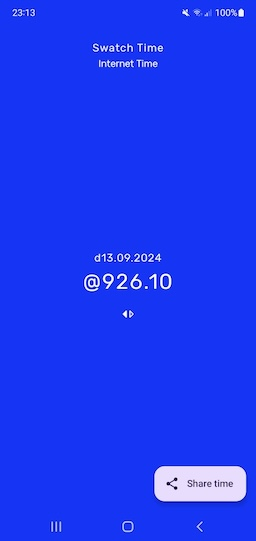

# Swatch Time
<https://play.google.com/store/apps/details?id=xyz.poolp.swatchtime>

A Jetpack compose app to display and share current [Swatch Internet Time][0].

Libraries and components used
--------------
* [Material Design 3][1] - Light and dark mode supported with MaterialTheme.
* [Koin][2] for [dependency injection][3]
* [kotlinx-datetime][4] - Using it to work with date and time.
* [StateFlow][5] - To emit state date and time updates.

[0]: https://en.wikipedia.org/wiki/Swatch_Internet_Time
[1]: https://developer.android.com/jetpack/compose/themes/material3
[2]: https://insert-koin.io
[3]: https://developer.android.com/training/dependency-injection
[4]: https://github.com/Kotlin/kotlinx-datetime
[5]: https://kotlinlang.org/api/kotlinx.coroutines/kotlinx-coroutines-core/kotlinx.coroutines.flow/-state-flow/
